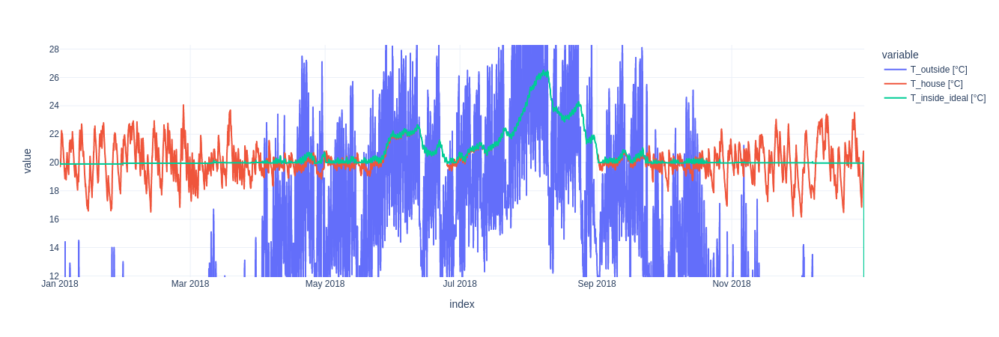

# Heat pumps

## What we want to do?

We want to build a dashboard to visualize the CO2 emissions of heat pumps

- Users gain insight about how their own heat pump setup
- Users can experiment how different setups would decrease their carbon footprint
- Suggestions how it could be optimized (e.g. optimal Vorlauftemperatur, storage size, etc.)
- Insight about heat pump performance in different geographic regions
- Scenario analysis of heat pump performance with future weather + energy mix predictions (up to 2050)
- Comparisons to other heating technologies (primary energy demand, CO2 emissions, costs)

- Would a higher percentage in solar electricity mix have changed CO2 emissions significantly?
- Does the temporal dependence make a difference

## How we want to do it

- Model the demand of different house types (domestic hot water usage, space heating) for different sizes, habitants, preferences (e.g. Warmduscher)
- 1. Standard demand profiles (DIN Norm)
  2. Model a more accurate temperature-demand-relationship based on synthetic data from Fraunhofer ISE
- Model the electricity usage of the heat pump based on current demand
- 1. Carnot cycle
  2. Interpolated datasheet reference values
  3. Fancy heat pump library?
- Model energy storage (hot water)
- 1. Naive storage of excess energy with rate and storage limits
  2. Model losses during storage
  3. Simple thresholding algorithm to optimize storage
- Model the CO2 intensity of available electricity from the datasources
- Interactive Plotly dashboard to visualize the results
- 1. Selectable User parameters as input -> Graphs of CO2 emissions over time
  2. KPIs like coefficient of performance (COP) 
  2. Visualization of saved CO2/cost/energy
  3. Colored map of heat pump efficiency for geographic locations
  4. Different Variants for global insight and single household
  5. 
- Integration with Solar team for PV production

## Documentation of sources
Carbon intensity factors:
Hydro pump storage: according to http://dse.univr.it/home/workingpapers/wp2021n8.pdf effective footprint is 31% above grid average due to round trip losses
specific heat demand:   http://www.bosy-online.de/heizlastberechnung_nach_din_en_12831.htm
                        https://www.waermepumpe.de/normen-technik/heizlastrechner/
                        https://www.npro.energy/main/de/load-profiles/heat-load-and-demand
Heating limit temperature: https://www.effizienzhaus-online.de/lexikon/heizgrenztemperatur/

3000 L Heizoel
30000 kWh Waermebedarf pro Jahr

Berater: 55000 kWh Waermebedarf

Electricity stats for Germany: https://www.smard.de/en/downloadcenter/download-market-data/?downloadAttributes=%7B%22selectedCategory%22:1,%22selectedSubCategory%22:1,%22selectedRegion%22:false,%22selectedFileType%22:%22CSV%22,%22from%22:1514761200000,%22to%22:1672613999999%7D

Annahme: - 95% von allem elektrischen Verbrauch wird als waerme im Gebaeude frei.
- Sonneneinstrahlung durch die Fenster wird ebenfalls als Waerme gewertet. Fenster sind 1/3 Ost, 1/3 West 1/3 Sud (Einerseits nehmen wir keine Nord Fenster an, andererseits werden auch Dachfenster als vertikale Fenster gewertet und Uebertragungen durch Dach und Waende vernachlassigt)
- Wohnflaeche zu Wand+Dachflaeche ist etwa Faktor 3 (Faustregel und Bestaetigt anhand von Ullis Haus Werten)
- Wir verwenden den Wert von Ullis Haus runtergerechnet auf die Wohnflaeche. Faktoren fur spezifische Wearmekapazitaet (from 140 to 315 kJ m-2 K-1) aus https://www.sciencedirect.com/science/article/pii/S2214509522005551

We simulate closing the blinds when it is too hot, ventilation losses, losses through walls, windows etc., solar radiation gains, gains through electrical appliances and habitants.

## CO2 controller

The controller tries to minimize CO2 emissions, by heating when electricity is less CO2 intensive. It is based on the single household model, described in [Paper](https://doi.org/10.1016/j.jclepro.2021.128926) but was extended to use a variable optimization period. Initially we thought the metric to optimize for was `g CO2eq/kWh` of the current electricity mix, but we soon realized, that the temperature dependent COP of the heat pump also has to be taken into consideration. We actually want to heat when `g CO2eq/kWh heating` is minimal. This metric takes into account both the temperature dependent COP and the CO2 intensity of the electricity mix.

Initially we used time window of 48h for computation. We estimate the heat demand during that time interval based on a temperature and usage forecast, which we simulate by adding 10% uniform random noise to the true temperature and usage profiles. Using a fixed time window of 48h the controller produced strong temperature oscillations in the winter, since in extreme cases it would heat for a day (e.g. a windy day, when the electricity is clean) and turn off the other day. In old buildings with poor isolation, this caused temperature deviations of up to +-4 °C from the target temperature, since the cooling rate was simply too high to allow for such a long heating pause.  

(3681.5 kg CO2eq total emissions)

We therefore introduced an extension to the base control strategy, that allows to choose a minimum and maximum temperature, from which a time window for optimization is computed. The window is simply determined by the time it takes for the building to get colder or hotter than the minimum temperature naturally. Thereby we ensure, that even in the most extreme cases (no heating for the entire period) the temperature deviation is limited. The controller is now able to produce a much more stable temperature profile, while still optimizing for CO2 emissions. An added benefit is, that it can now also use longer periods for optimization if the house has a sufficient heat capacity to isolation ratio or when the outside temperature is close to target temperature anyway.

Note that the temperature deviation is now limited to approximately +-1 °C from the target temperature. Variations outside of this range are due to the imperfect weather forecast (4482.2 kg CO2eq total emissions)

Of course a larger temperature variation allows for lower CO2 emissions, since the controller has more freedom to choose when to heat. The following plot shows the CO2 emissions for different allowed temperature variations.

