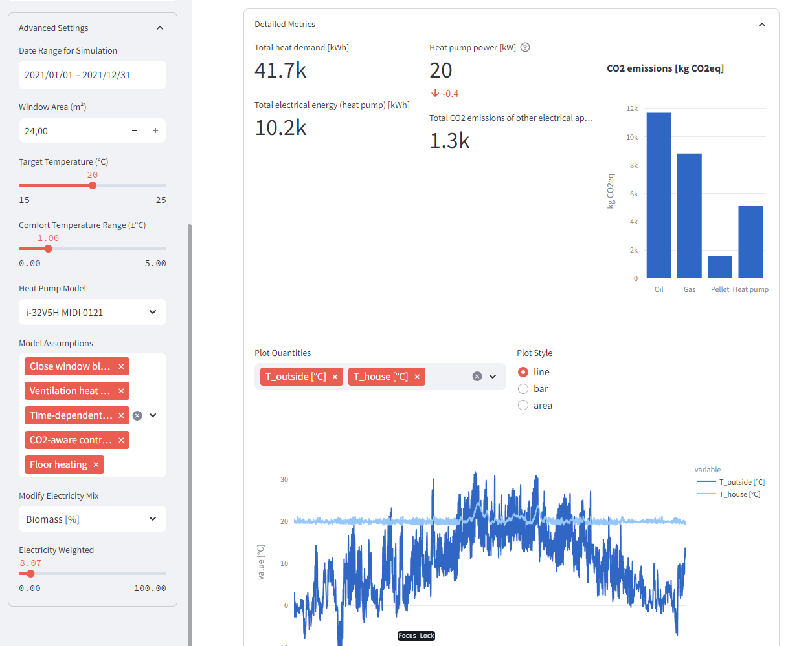

# Heat pumps

## Introduction
$25.2\%$ of Germany's energy budget are used for heating buildings, the majority of which ($17.5\%$ points) is in the residential sector. As such, it produces immense emissions, $126 Mt$ in 2019 for example [Bundesministerium für Wirtschaft und Klimaschutz](https://www.bmwk.de/Redaktion/DE/Publikationen/Energie/energieeffizienz-in-zahlen-entwicklungen-und-trends-in-deutschland-2021.html). Reducing these emissions is of utmost importance to achieve the climate goals and mitigate the impact of global warming. 

With the expansion of renewable electricity sources, heat pumps have the potential to provide a completely $CO_2$ neutral way of heating, but even with today's electric mix, they usually produce less emissions than fossil based heat sources. In this project we built an tool analysis tool for researchers and end consumers to estimate the $CO_2$ impact of air-water heat pumps for residential buildings.

## Model Description
We model the building as an open thermodynamic system in a heat bath (outside environment). The entire building is assigned a single temperature, so like a homogeneous block in a perfectly equilibrated steady state. The building is parametrized by its heat capacity $C$, volume $V$, the specific heat transfer coefficients of its different surfaces $U_i$, the surface area of walls $A_{walls}$, roof $A_{roof}$, floor $A_{floor}$ and lastly windows $A_{windows}$. Specific heat capacities were taken from [this paper on the role of specific heat capacity on building energy performance and thermal discomfort](https://www.sciencedirect.com/science/article/pii/S2214509522005551) and interpolated manually for different building ages. The specific U values mapped to building age, according to the classes specified in [Gebäudeenergiegesetz (GEG), Anlage 1](https://www.wienerberger.de/content/dam/wienerberger/germany/marketing/documents-magazines/instructions-guidelines/wall/DE_MKT_DOC_PON_Schnelluebersicht_GEG_KfW_Wienerberger.pdf).
If solar radiation is simulated, the windows are assigned a value $g_{window}$ depending on the building age, which specifies the transmittance of vertical radiation through glass. This is lower for more modern, multi layer windows and higher for older, single layer windows [Richtwerte finden sich in DIN 4108-4 als Gesamtenergiedurchlassgrade bei senkrechtem Strahlungseinfall](https://www.baunormenlexikon.de/norm/din-4108-4/c71c3881-b7fc-47d4-8992-2b1e8609dc03). All the surface areas are computed from the living area input by the user, evenly split among the given number of floors by assuming  $3 m$ height per floor and a flat, square roof and base of the building.

The transfer due to the temperature gradient to the outside at a given timestep is then: 

$
\begin{equation}
\dot{Q}=UA\Delta T = \sum{U_{i} A_{i} (T_{outside} - T_{house})}
\end{equation}
$

This equation gets additional terms for ventilation, heat produced by electrical appliances, habitants, and heating due to solar radiation.
$
\begin{equation}
\dot{Q}=UA\Delta T + 0.95\cdot P_{internal} + g_{window} P_{solar}  +P_{heat \: pump} + n_{ventilation\:rate} c_{air} V_{air} \rho_{air} 
\end{equation}
$

Finally, the temperature in the house is defined as $T_{house} = \frac{Q}{C}$. The ODE is integrated with a simple explicit Euler integrator with a step size of $1 h$, which is the time resolution at which we handle all the data.

| Column   |      Unit     | Description| 
|----------|:----------------:|:----------:|
| p_solar (south/east/west) | $kW/m^2$ | Specific solar radiation strength for a vertical surface facing south/west/east respectively. This already includes corrective factors from literature for average shading, non-perpendicular radiation and self shadowing due to the window frame. |
| P_solar | $kW$ | Total heating power due to solar irradiation, assuming equal distribution of windows over north, south, east and west. Computed as $\sum{A_{windows \: i} \cdot p_{solar \: i}}$ |
| T_{outside} | $C^\circ$ | Outside air temperature used for computing the heat losses and COP of the heat pump |
| T_{house} | $C^\circ$ | Average temperature of the building. Air temperature and wall temperature are not treated independently. |
| Wind offshore, Biomass, Nuclear... | $\%$ | Percentage of the specific energy source in the electricity mix.  |
| Intensity | $g\cdot CO_{2} {eqivalent}/kWh$ | The $CO_2$ equivalent intensity of one $kWh$ electricity at the current timestep, computed by multiplying the fractions of different electricity sources with their specific $CO_2$ intensities |
| Intensity per heat | $g\cdot CO_{2} {eqivalent}/kWh$ | The $CO_2$ equivalent intensity of one $kWh$ of heating using the heat pump, computed as $\frac{Intensity  \: electricity}{COP}$|
| P_el appliances | $kW$ | Electricity consumption of household appliances, e.g. oven, computer... This is added to the house as heat using a factor of $0.95$ |
| P_el heat pump | $kW$ | Electricity consumption of the heat pump. This is not added as heat to the building. |
| Q_dot_demand | $kW$ | Theoretical heat demand to fulfil the temperature requirements. |
| Q_dot_supplied | $kW$ | Actual amount of heat supplied to the building by the heat pump. May be less than Q_dot_demand if the heat pump is chosen too small |
| Q_dot_transferred | $kW$ | Heat transfer to the outside of the building through walls, windows, ceiling and floor. |
| Q_dot_ventilation | $kW$ | Heat transfer due to periodic ventilation of the building. We assume that $35\%$ of the air volume in the building are replaced per hour ([According to Standard 62.2-2016 - Ventilation and Acceptable Indoor Air Quality in Residential Buildings](https://www.ashrae.org/technical-resources/bookstore/standards-62-1-62-2)). |

### Heat pump model
Vorlauf temperatur, wärmepumpenmodelle

## Dashboard Overview
### Simplified
The simplified model is populated by a series of sensible defaults for all inputs, which are not exposed to the user. For example, we set the $A_{windows}$ to $20\%$ of the living area, activate all available model assumptions except for weather forecast uncertainty and set the simulation range from 1. January to 31. December of the selected year. Based on $W/m^2$ heating requirement values from DIN EN 12831-1 we filter the available list of heat pump models and select a suitably sized pump automatically. The electricity mix is by default the true, historic electricity generation mix of the time period, as downloaded from [SMARD](https://www.smard.de/en/downloadcenter/download-market-data/), a service offered by the Bundesnetzagentur. If no electricity data is available for the selected year, we repeat the closest available year periodically to fill the entire timeseries. 

### Academic 
The academic Dashboard version is intended for deeper exploration of the data. We tried to expose as much control over the simulation parameters as possible, including some model assumptions. Particularly the electricity mix input is valuable for testing hypothetical scenarios, e.g. different expansions of renewable energies in as part of the energy mix. 

## CO2 controller

The controller tries to minimize CO2 emissions, by heating when electricity is less CO2 intensive. It is based on the single household model, described in [Paper](https://doi.org/10.1016/j.jclepro.2021.128926) but was extended to use a variable optimization period. Initially we thought the metric to optimize for was `g CO2eq/kWh` of the current electricity mix, but we soon realized, that the temperature dependent COP of the heat pump also has to be taken into consideration. We actually want to heat when `g CO2eq/kWh heating` is minimal. This metric takes into account both the temperature dependent COP and the CO2 intensity of the electricity mix.

Initially we used time window of 48h for computation. We estimate the heat demand during that time interval based on a temperature and usage forecast, which we simulate by adding 10% uniform random noise to the true temperature and usage profiles. Using a fixed time window of 48h the controller produced strong temperature oscillations in the winter, since in extreme cases it would heat for a day (e.g. a windy day, when the electricity is clean) and turn off the other day. In old buildings with poor isolation, this caused temperature deviations of up to +-4 °C from the target temperature, since the cooling rate was simply too high to allow for such a long heating pause.  

(3681.5 kg CO2eq total emissions)

We therefore introduced an extension to the base control strategy, that allows to choose a minimum and maximum temperature, from which a time window for optimization is computed. The window is simply determined by the time it takes for the building to get colder or hotter than the minimum temperature naturally. Thereby we ensure, that even in the most extreme cases (no heating for the entire period) the temperature deviation is limited. The controller is now able to produce a much more stable temperature profile, while still optimizing for CO2 emissions. An added benefit is, that it can now also use longer periods for optimization if the house has a sufficient heat capacity to isolation ratio or when the outside temperature is close to target temperature anyway.

Note that the temperature deviation is now limited to approximately +-1 °C from the target temperature. Variations outside of this range are due to the imperfect weather forecast (4482.2 kg CO2eq total emissions)

Of course a larger temperature variation allows for lower CO2 emissions, since the controller has more freedom to choose when to heat, as can be seen in the following figure.

All the figures in this section are computed for a $200m^2$ building from 1980, with the reference usage profile set to family and simulation year 2021.

## Model validation
To validate our model, we compared the results to various rule of thumb formulas from DIN-12831. 

There are tabular reference values for the maximum outside temperature at which heating is required (Heizgrenztemperatur) defined in the standard. Since real buildings have a significant heat capacity, they react delayed to temperature changes. We therefore read off the 7 day moving average of $T_{outside}$ at points when the heat pump turned off for more than 7 consecutive days. The results deviated by $\le 0.5^\circ C$ from the tabular values in all trsted buildings below KfW70. For modern buildings, our simulation predicted shorter heating periods than the standard.

We also compared our model to [standard heating load profiles](https://www.npro.energy/main/de/load-profiles/heat-load-and-demand) and got results within a reasonable deviation range of $\pm 10\%$.

Finally we compared our results to a real single family house from 1980, for which we knew the heat demand in previous years. We also had estimated heat demands, heat capacities and specific transfer coefficients of the building as determined by a heating consultant. The heat capacity computed by the model is $22\%$ below our reference. The heat transfer estimate on the other hand is very close. Our model predicts $34600 kWh$ of heat demand in 2021 ($29700 kWh$), compared to the $\approx 30000 kWh$ historically used for heating. 

In general we noticed that our model predicted lower heat demand for modern KfW70, KfW40 and GEG20 buildings, compared to the DIN standard. We also observed excessive heating in the summer, due to solar radiation and other internal gains. This is apparently a [known issue with the standard](https://www.haustec.de/heizung/waermeerzeugung/heizlast-nach-din-en-12831-die-luecke-zwischen-regelwerk-und-realitaet), as it completely ignores internal heat sources, even though they are a relevant factor in well isolated buildings.

## Documentation of sources
Carbon intensity factors:
Hydro pump storage: according to http://dse.univr.it/home/workingpapers/wp2021n8.pdf effective footprint is 31% above grid average due to round trip losses
specific heat demand:   http://www.bosy-online.de/heizlastberechnung_nach_din_en_12831.htm
                        https://www.waermepumpe.de/normen-technik/heizlastrechner/
                        https://www.npro.energy/main/de/load-profiles/heat-load-and-demand
Heating limit temperature: https://www.effizienzhaus-online.de/lexikon/heizgrenztemperatur/

3000 L Heizoel
30000 kWh Waermebedarf pro Jahr

Berater: 55000 kWh Waermebedarf

Electricity stats for Germany: https://www.smard.de/en/downloadcenter/download-market-data/?downloadAttributes=%7B%22selectedCategory%22:1,%22selectedSubCatego# Heat pumps

## Introduction
$25.2\%$ of Germany's energy budget are used for heating buildings, the majority of which ($17.5\%$ points) is in the residential sector. As such, it produces immense emissions, $126 Mt$ in 2019 for example [Bundesministerium für Wirtschaft und Klimaschutz](https://www.bmwk.de/Redaktion/DE/Publikationen/Energie/energieeffizienz-in-zahlen-entwicklungen-und-trends-in-deutschland-2021.html). Reducing these emissions is of utmost importance to achieve the climate goals and mitigate the impact of global warming. 

With the expansion of renewable electricity sources, heat pumps have the potential to provide a completely $CO_2$ neutral way of heating, but even with today's electric mix, they usually produce less emissions than fossil based heat sources. In this project we built an tool analysis tool for researchers and end consumers to estimate the $CO_2$ impact of air-water heat pumps for residential buildings.

## Model Description
We model the building as an open thermodynamic system in a heat bath (outside environment). The entire building is assigned a single temperature, so like a homogeneous block in a perfectly equilibrated steady state. The building is parametrized by its heat capacity $C$, volume $V$, the specific heat transfer coefficients of its different surfaces $U_i$, the surface area of walls $A_{walls}$, roof $A_{roof}$, floor $A_{floor}$ and lastly windows $A_{windows}$. Specific heat capacities were taken from [this paper on the role of specific heat capacity on building energy performance and thermal discomfort](https://www.sciencedirect.com/science/article/pii/S2214509522005551) and interpolated manually for different building ages. The specific U values mapped to building age, according to the classes specified in [Gebäudeenergiegesetz (GEG), Anlage 1](https://www.wienerberger.de/content/dam/wienerberger/germany/marketing/documents-magazines/instructions-guidelines/wall/DE_MKT_DOC_PON_Schnelluebersicht_GEG_KfW_Wienerberger.pdf).
If solar radiation is simulated, the windows are assigned a value $g_{window}$ depending on the building age, which specifies the transmittance of vertical radiation through glass. This is lower for more modern, multi layer windows and higher for older, single layer windows [Richtwerte finden sich in DIN 4108-4 als Gesamtenergiedurchlassgrade bei senkrechtem Strahlungseinfall](https://www.baunormenlexikon.de/norm/din-4108-4/c71c3881-b7fc-47d4-8992-2b1e8609dc03). All the surface areas are computed from the living area input by the user, evenly split among the given number of floors by assuming  $3 m$ height per floor and a flat, square roof and base of the building.

The transfer due to the temperature gradient to the outside at a given timestep is then: 

$
\begin{equation}
\dot{Q}=UA\Delta T = \sum{U_{i} A_{i} (T_{outside} - T_{house})}
\end{equation}
$

This equation gets additional terms for ventilation, heat produced by electrical appliances, habitants, and heating due to solar radiation.
$
\begin{equation}
\dot{Q}=UA\Delta T + 0.95\cdot P_{internal} + g_{window} P_{solar}  +P_{heat \: pump} + n_{ventilation\:rate} c_{air} V_{air} \rho_{air} 
\end{equation}
$

Finally, the temperature in the house is defined as $T_{house} = \frac{Q}{C}$. The ODE is integrated with a simple explicit Euler integrator with a step size of $1 h$, which is the time resolution at which we handle all the data.

| Column   |      Unit     | Description| 
|----------|:----------------:|:----------:|
| p_solar (south/east/west) | $kW/m^2$ | Specific solar radiation strength for a vertical surface facing south/west/east respectively. This already includes corrective factors from literature for average shading, non-perpendicular radiation and self shadowing due to the window frame. |
| P_solar | $kW$ | Total heating power due to solar irradiation, assuming equal distribution of windows over north, south, east and west. Computed as $\sum{A_{windows \: i} \cdot p_{solar \: i}}$ |
| T_{outside} | $C^\circ$ | Outside air temperature used for computing the heat losses and COP of the heat pump |
| T_{house} | $C^\circ$ | Average temperature of the building. Air temperature and wall temperature are not treated independently. |
| Wind offshore, Biomass, Nuclear... | $\%$ | Percentage of the specific energy source in the electricity mix.  |
| Intensity | $g\cdot CO_{2} {eqivalent}/kWh$ | The $CO_2$ equivalent intensity of one $kWh$ electricity at the current timestep, computed by multiplying the fractions of different electricity sources with their specific $CO_2$ intensities |
| Intensity per heat | $g\cdot CO_{2} {eqivalent}/kWh$ | The $CO_2$ equivalent intensity of one $kWh$ of heating using the heat pump, computed as $\frac{Intensity  \: electricity}{COP}$|
| P_el appliances | $kW$ | Electricity consumption of household appliances, e.g. oven, computer... This is added to the house as heat using a factor of $0.95$ |
| P_el heat pump | $kW$ | Electricity consumption of the heat pump. This is not added as heat to the building. |
| Q_dot_demand | $kW$ | Theoretical heat demand to fulfil the temperature requirements. |
| Q_dot_supplied | $kW$ | Actual amount of heat supplied to the building by the heat pump. May be less than Q_dot_demand if the heat pump is chosen too small |
| Q_dot_transferred | $kW$ | Heat transfer to the outside of the building through walls, windows, ceiling and floor. |
| Q_dot_ventilation | $kW$ | Heat transfer due to periodic ventilation of the building. We assume that $35\%$ of the air volume in the building are replaced per hour ([According to Standard 62.2-2016 - Ventilation and Acceptable Indoor Air Quality in Residential Buildings](https://www.ashrae.org/technical-resources/bookstore/standards-62-1-62-2)). |

### Heat pump model
Vorlauf temperatur, wärmepumpenmodelle

## Dashboard Overview
### Simplified
The simplified model is populated by a series of sensible defaults for all inputs, which are not exposed to the user. For example, we set the $A_{windows}$ to $20\%$ of the living area, activate all available model assumptions except for weather forecast uncertainty and set the simulation range from 1. January to 31. December of the selected year. Based on $W/m^2$ heating requirement values from DIN EN 12831-1 we filter the available list of heat pump models and select a suitably sized pump automatically. The electricity mix is by default the true, historic electricity generation mix of the time period, as downloaded from [SMARD](https://www.smard.de/en/downloadcenter/download-market-data/), a service offered by the Bundesnetzagentur. If no electricity data is available for the selected year, we repeat the closest available year periodically to fill the entire timeseries. 

### Academic 
The academic Dashboard version is intended for deeper exploration of the data. We tried to expose as much control over the simulation parameters as possible, including some model assumptions. Particularly the electricity mix input is valuable for testing hypothetical scenarios, e.g. different expansions of renewable energies in as part of the energy mix. 

## CO2 controller

The controller tries to minimize CO2 emissions, by heating when electricity is less CO2 intensive. It is based on the single household model, described in [Paper](https://doi.org/10.1016/j.jclepro.2021.128926) but was extended to use a variable optimization period. Initially we thought the metric to optimize for was `g CO2eq/kWh` of the current electricity mix, but we soon realized, that the temperature dependent COP of the heat pump also has to be taken into consideration. We actually want to heat when `g CO2eq/kWh heating` is minimal. This metric takes into account both the temperature dependent COP and the CO2 intensity of the electricity mix.

Initially we used time window of 48h for computation. We estimate the heat demand during that time interval based on a temperature and usage forecast, which we simulate by adding 10% uniform random noise to the true temperature and usage profiles. Using a fixed time window of 48h the controller produced strong temperature oscillations in the winter, since in extreme cases it would heat for a day (e.g. a windy day, when the electricity is clean) and turn off the other day. In old buildings with poor isolation, this caused temperature deviations of up to +-4 °C from the target temperature, since the cooling rate was simply too high to allow for such a long heating pause.  

(3681.5 kg CO2eq total emissions)

We therefore introduced an extension to the base control strategy, that allows to choose a minimum and maximum temperature, from which a time window for optimization is computed. The window is simply determined by the time it takes for the building to get colder or hotter than the minimum temperature naturally. Thereby we ensure, that even in the most extreme cases (no heating for the entire period) the temperature deviation is limited. The controller is now able to produce a much more stable temperature profile, while still optimizing for CO2 emissions. An added benefit is, that it can now also use longer periods for optimization if the house has a sufficient heat capacity to isolation ratio or when the outside temperature is close to target temperature anyway.

Note that the temperature deviation is now limited to approximately +-1 °C from the target temperature. Variations outside of this range are due to the imperfect weather forecast (4482.2 kg CO2eq total emissions)

Of course a larger temperature variation allows for lower CO2 emissions, since the controller has more freedom to choose when to heat, as can be seen in the following figure.

All the figures in this section are computed for a $200m^2$ building from 1980, with the reference usage profile set to family and simulation year 2021.

## Model validation
To validate our model, we compared the results to various rule of thumb formulas from DIN-12831. 

There are tabular reference values for the maximum outside temperature at which heating is required (Heizgrenztemperatur) defined in the standard. Since real buildings have a significant heat capacity, they react delayed to temperature changes. We therefore read off the 7 day moving average of $T_{outside}$ at points when the heat pump turned off for more than 7 consecutive days. The results deviated by $\le 0.5^\circ C$ from the tabular values in all trsted buildings below KfW70. For modern buildings, our simulation predicted shorter heating periods than the standard.

We also compared our model to [standard heating load profiles](https://www.npro.energy/main/de/load-profiles/heat-load-and-demand) and got results within a reasonable deviation range of $\pm 10\%$.

Finally we compared our results to a real single family house from 1980, for which we knew the heat demand in previous years. We also had estimated heat demands, heat capacities and specific transfer coefficients of the building as determined by a heating consultant. The heat capacity computed by the model is $22\%$ below our reference. The heat transfer estimate on the other hand is very close. Our model predicts $34600 kWh$ of heat demand in 2021 ($29700 kWh$ in 2020), compared to the $\approx 30000 kWh$ historically used for heating. 

In general we noticed that our model predicted lower heat demand for modern KfW70, KfW40 and GEG20 buildings, compared to the DIN standard. We also observed excessive heating in the summer, due to solar radiation and other internal gains. This is apparently a [known issue with the standard](https://www.haustec.de/heizung/waermeerzeugung/heizlast-nach-din-en-12831-die-luecke-zwischen-regelwerk-und-realitaet), as it completely ignores internal heat sources, even though they are a relevant factor in well isolated buildings.

## Documentation of sources
Carbon intensity factors:
Hydro pump storage: according to http://dse.univr.it/home/workingpapers/wp2021n8.pdf effective footprint is 31% above grid average due to round trip losses
specific heat demand:   http://www.bosy-online.de/heizlastberechnung_nach_din_en_12831.htm
                        https://www.waermepumpe.de/normen-technik/heizlastrechner/
                        https://www.npro.energy/main/de/load-profiles/heat-load-and-demand
Heating limit temperature: https://www.effizienzhaus-online.de/lexikon/heizgrenztemperatur/

3000 L Heizoel
30000 kWh Waermebedarf pro Jahr

Berater: 55000 kWh Waermebedarf

Electricity stats for Germany: https://www.smard.de/en/downloadcenter/download-market-data/?downloadAttributes=%7B%22selectedCategory%22:1,%22selectedSubCategory%22:1,%22selectedRegion%22:false,%22selectedFileType%22:%22CSV%22,%22from%22:1514761200000,%22to%22:1672613999999%7D

- Wohnflaeche zu Wand+Dachflaeche ist etwa Faktor 3 (Faustregel und Bestaetigt anhand von Ullis Haus Werten)
- Wir verwenden den Wert von Ullis Haus runtergerechnet auf die Wohnflaeche. Faktoren fur spezifische Wearmekapazitaet (from 140 to 315 kJ m-2 K-1) aus https://www.sciencedirect.com/science/article/pii/S2214509522005551ry%22:1,%22selectedRegion%22:false,%22selectedFileType%22:%22CSV%22,%22from%22:1514761200000,%22to%22:1672613999999%7D

- Wohnflaeche zu Wand+Dachflaeche ist etwa Faktor 3 (Faustregel und Bestaetigt anhand von Ullis Haus Werten)
- Wir verwenden den Wert von Ullis Haus runtergerechnet auf die Wohnflaeche. Faktoren fur spezifische Wearmekapazitaet (from 140 to 315 kJ m-2 K-1) aus https://www.sciencedirect.com/science/article/pii/S2214509522005551
